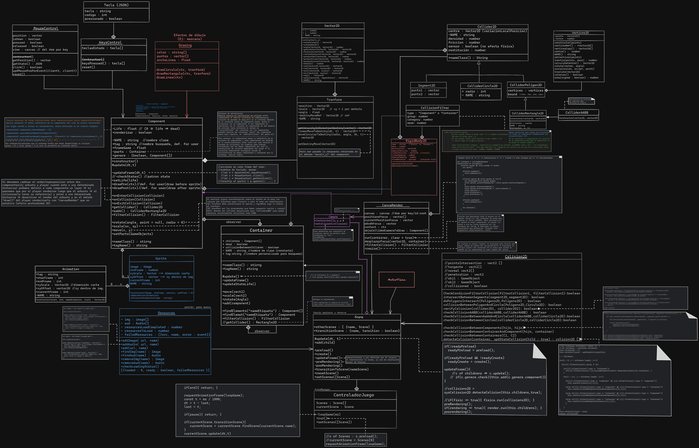

# EngineOfGame2D
Diseño e implementacion de libreria que ofrece un conjunto de clases que facilitan el desarrollo de video juegos 2D. Este proyecto tiene como objetivo comprender el funcionamiento de un motor de juego 2D e implementar patrones de diseño, análisis de complejidad algorítmica, correcto uso de estructuras de datos para mayor rendimiento del mismo. Permite el manejo (tranformaciones y comunicaciones) entre objetos complejos compuestos con diferentes componentes, sistema de colisiones, renderizado, etc.  {Estado: En desarrollo} 

**DIAGRAMA DE CLASE:**

Algunas de las pautas en cuanta para el diseño e implementacion:
- *Patron pool de componentes:* cuando un conjunto de componentes se destruyen(eliminan) y crean(añaden) con frecuencia => este patron permite reutilizar(suspendiendolo/cambiando de posicion/estado en lugar de quitar y añadir componentes a un array dianmico) los componentes reduciendo el costo de redimnecionar por ejemplo un array de componentes en memoria cada ves que se destruyen. Por ejemplo systema de particulas, balas, etc.
  
- *Uso de estructura de datos* array para container o partes de componentes que permite una gran velocidad de recorrido de componentes para sistema de deteccion de colisiones, actualizacion de estado en cada frame, etc. Esto dado que los array son un conjunto consecutivo reservado(direcciones) en memoria, lo que permite una gran velocidad de el recorrido/lectura de componentes (Teniendo en cuanta el problema de rendimiento para casos contemplados por item "patron pool de componentes").
  
- *Analisis de complejidad:* se busca reducir lo mas posible la complejidad algoritmica implementando para Colliders poligonos 2D o conjunto de componentes(paredes,estrucutras,etc colisionables) Rectangulos 2D (colliderAABB), de este modo encerar los mismos en rectangulo que es menos costoso de verificar por colicion => de colisionar con el mismo se procede a ejecutar los algortimos para verificar poligonos(mas costosos al verificar con cada interseccion entre segmentos) o recorrer cada componente de un conjunto componentes dentro de espacio de colision AABB => Logramos reducir para cuando se tiene un gran conjunto de componentes la complejidad algoritmica (costo) cuando aumenta "N:numero de componentes en ecena". 
Asi como es solo detectar la colision una sola vez entre componetes de modo de reducir la complejidad N^2 : 2=4, 3=6, 4=16, 5=25, 6=36, .. -- a --> 2=1, 3=3, 4=6, 5=10, 6=15, ..
Implementacion de filtro de colision en containers: de modo de reducir la verificacion de colisiones en conjunto de componentes. ETC.

- *Investigar patrones estructurales, de comportamineto y creacionales* a la hora de diseñar la libreria como los mencionados en el diagrama de clases. [https://refactoring.guru/es/design-patterns]
